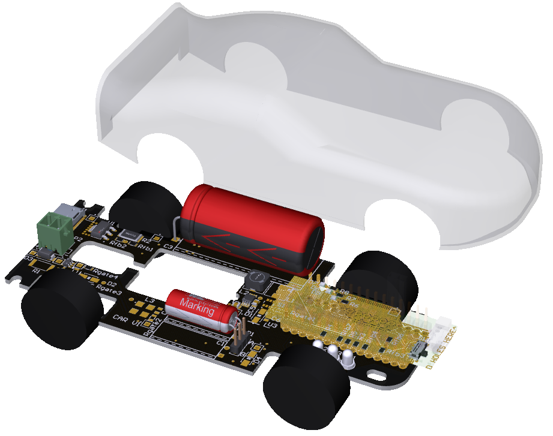
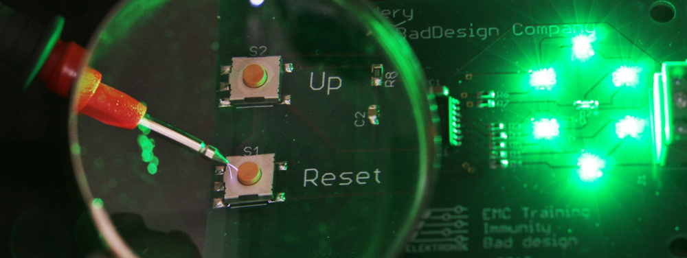
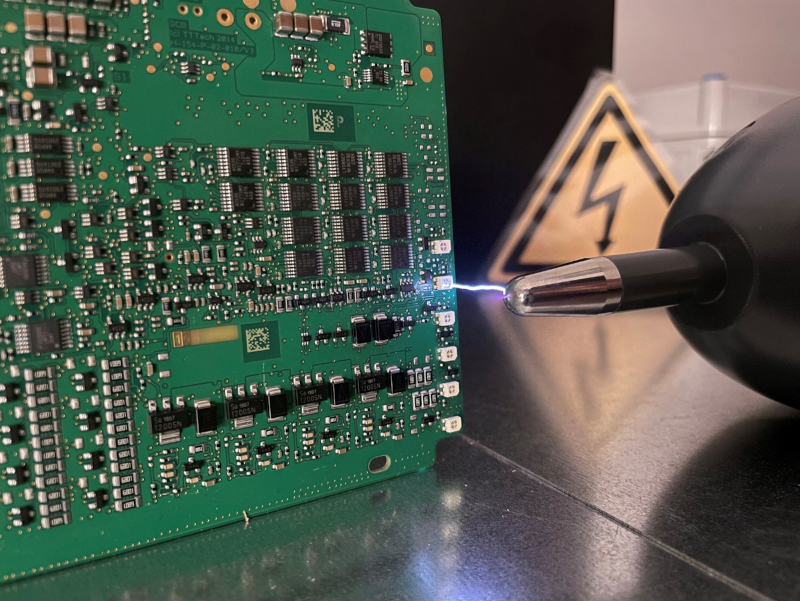
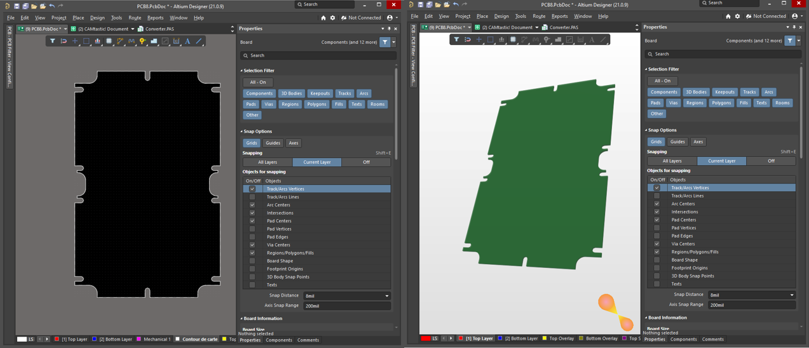
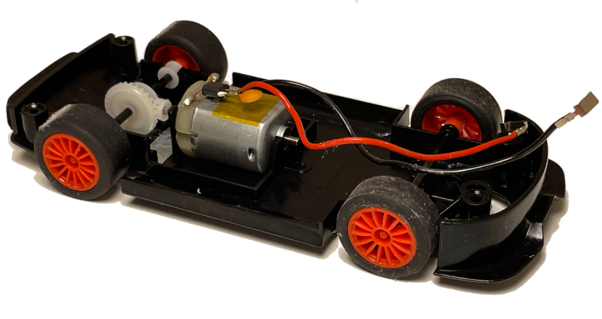
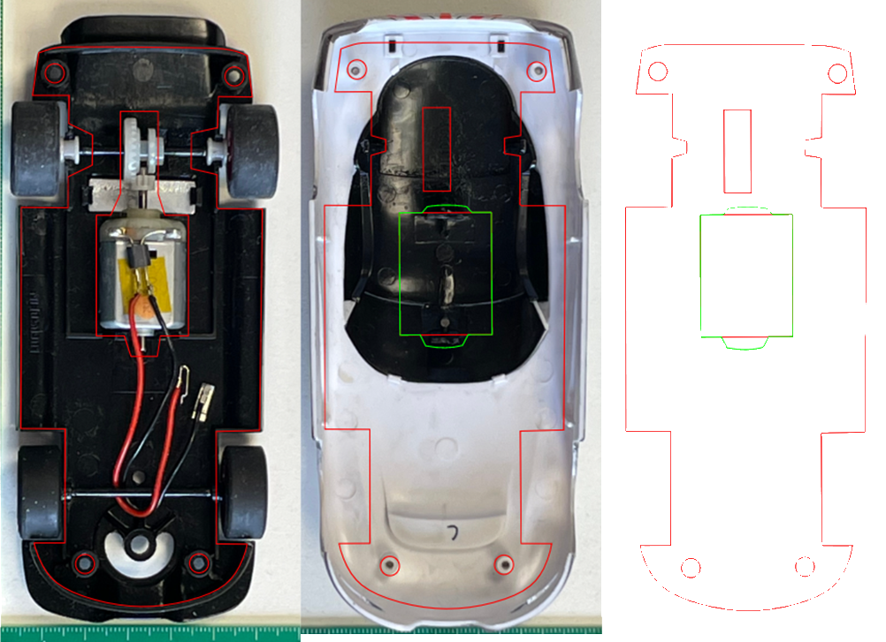
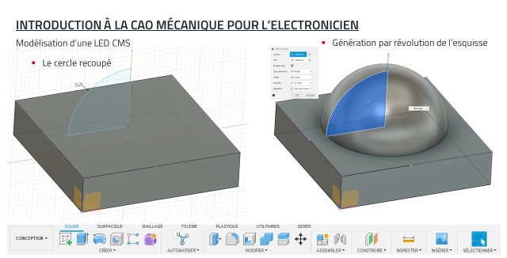
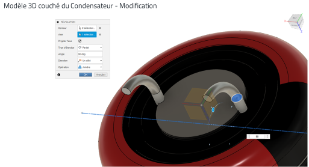
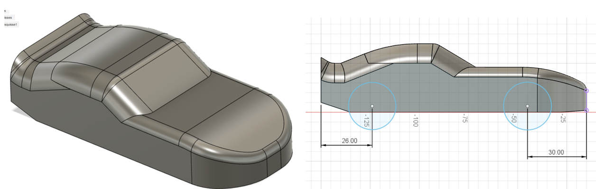

# supercapacitor-car

La voiture à base de supercondensateur est un sujet d'étude mis en place dans le cadre de l'enseignement des modules : 
- Codesign Electronique Mécanique Thermique
- Systèmes Embarqués

Cette base matérielle et logicielle est mise à disposition des enseignants souhaitant familiariser leurs étudiants à la conception de cartes électroniques.
L'approche ludique de la mobilité électrique proposée par cette maquette pédagogique permet néanmoins de se familiariser avec des outils professionnels de conception et de programmation : 
- Altium Designer
- Fusion 360
- STM32 CUBE IDE

Utilisable de manière compétitive, cette permet aux étudiants de rechercher des optimisations pour gagner des courses d'accéleration ou d'endurance.

Grace à l'usage comme support d'un jouet produit en grande série il est possible d'équiper à moindre frais les etablissements.
La disponibilité auprès de plusieurs marques des modules de type "nano" permet de choisir parmi une grande variété de micro-contrôleurs.
- STmicro Nucléo Nano
- Microchip Arduino Nano

# Codesign Electronique Mécanique Thermique : 
Concevoir un produit à l‘épreuve de son environnement

### Cours 1 - Etude de cas + travail sur le contour de cartes

Points clés du design mécanique des enveloppes de prduits électroniques : 
- L'étanchéité
- La résistance aux chocs
- La protection contre les décharges électrostatiques

 

Décharges électrostatiques sur la face avant d'un produit

IP, IK, ESD : Modélisation par les différentes normes des contraintes d'environnement

Import de contour de carte dans un logiciel de CAO électronique

### Cours 2 - La thermique pour l'électronicien
 

### Cours 3 - Projet de synthèse, analyse "moteur/hacheur/chargeur" + intégration en boitier
 

### Cours 4 - Conception mécanique pour l'électronicien
 

## Cours 5 - Optimisation de l'intégration mécanique et gestion thermique au niveau du PCB

